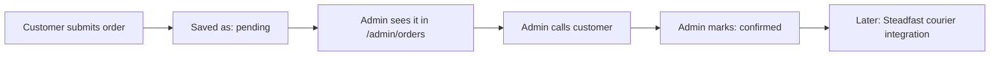

# Anniymah MVP — Tech Spec (Next.js + Supabase)

2026-09-18 · @Someone

## Overview

This MVP replaces the current static/serverless landing page with a real backend, while the full multi-product e-commerce build (cart, checkout, catalog) stays a separate, later phase — see Phase 2 below. Scope is deliberately narrow: one landing page, one product/offer, manual order confirmation by the owner.

**Goal:** the owner edits the landing page (headline, price, image, optional "what's inside" section) without touching code, sees incoming orders in one place, and confirms them after a phone call — backed by a real database instead of a one-way SMS.

## Tech stack (MVP)

- Frontend: Next.js (App Router) + Tailwind CSS, deployed on Vercel
- Backend: Supabase — Postgres database, Auth (admin login), Storage (landing page images)
- No separate server: Next.js API routes / Server Actions talk to Supabase directly
- Optional: an SMS gateway (Alpha SMS or similar) called from a Next.js API route on order creation, if an instant SMS ping to the owner's phone stays alongside the admin dashboard

This stack is intentionally light for the MVP. The heavier stack (NestJS, Prisma, Redis, etc.) is scoped for Phase 2 — see below.

## Pages

| # | Page | Access | Purpose |
| --- | --- | --- | --- |
| 1 | `/admin/login` | Public (form) | Supabase Auth email/password login |
| 2 | `/admin/landing` | Admin only | Edit the landing page: Part 1 (headline, description, price, image) and optional Part 2 — "কম্বোতে যা থাকছে" (title, image, short text) |
| 3 | `/admin/orders` | Admin only | List orders, accordion per order showing name/phone/address/qty/notes, status control (Pending → Confirmed → Delivered/Cancelled) |
| 4 | `/` | Public | Renders the current landing page config, order form, confirm button |

## Data model (Supabase / Postgres)

**`landing_page`** (single row for the MVP)

- `id`, `title`, `description`, `price`, `phone`, `image_url` — Part 1
- `part2_enabled` (bool), `part2_title`, `part2_text`, `part2_image_url` — Part 2, optional
- `updated_at`

**`orders`**

- `id`, `customer_name`, `phone`, `address`, `quantity`, `unit_price`, `total`, `notes`
- `status` (enum: `pending` · `confirmed` · `cancelled` · `delivered`)
- `courier_tracking_id` (nullable — filled in once Steadfast is integrated)
- `created_at`, `confirmed_at`

Admin users are handled by Supabase Auth directly — no custom table needed for one owner account.

## Row Level Security (RLS)

Easiest part to get wrong with Supabase, so calling it out on its own:

- `landing_page`: public can `SELECT` (read) only; `INSERT`/`UPDATE` restricted to the authenticated admin.
- `orders`: public (anon key) can `INSERT` only — never `SELECT`, `UPDATE`, or `DELETE`. A customer should not be able to read anyone's order, including their own. Admin (authenticated) gets full access.
- Enable RLS on both tables from day one — Supabase tables are open by default until RLS is turned on, which is a common source of accidental data leaks.

## Image handling & Supabase free-tier limits

Free tier: 1 GB total Storage, 2 GB bandwidth/month, 500 MB database.

- Compress images client-side before upload (e.g. `browser-image-compression` in the admin editor) — target under \~200 KB per image, resized to the actual display size rather than uploading a full-resolution photo.
- Convert to WebP where possible — same visual quality at a smaller file size than JPEG/PNG.
- With only 2 images max per landing page (Part 1 + Part 2) at \~200 KB each, storage isn't a concern; the real constraint is monthly bandwidth once the page gets real traffic — compression keeps repeated image loads cheap.

## Order workflow



For now, "confirmed" is a manual click after a phone call. Once Steadfast is integrated, confirming an order can automatically create a consignment via their API and store the tracking ID against the order.

## Environment variables

```
NEXT_PUBLIC_SUPABASE_URL=
NEXT_PUBLIC_SUPABASE_ANON_KEY=
SUPABASE_SERVICE_ROLE_KEY=   # server-side only — never exposed to the browser
```

Add an SMS gateway key here too only if the instant-SMS-ping feature stays alongside the admin dashboard.

## Gaps to close for a solid MVP

- **RLS policies** (above) — the single most common thing to forget with Supabase.
- **Spam protection** on the public order form — a honeypot field or Cloudflare Turnstile (free) stops bot spam without adding friction for real customers.
- **Order status audit** — store `confirmed_at` / who confirmed, useful once there's more than one admin.
- **CSV export** of orders — handy for manual reconciliation before Steadfast is wired up.
- **Password reset** for the admin account — Supabase Auth supports this out of the box, just needs wiring into the login page.
- **Mobile-friendly admin** — the owner will likely check orders from a phone, so `/admin/orders` needs to work well on small screens, not just desktop.

## Phase 2 (later): full e-commerce

Kept separate from this MVP on purpose — not built now, just flagged so today's schema doesn't box it in.

**Planned stack:** NestJS (API backend), Prisma (ORM), PostgreSQL (self-managed, replacing Supabase's managed Postgres), Redis (caching/queues), Tawk.to (live chat widget for customer support).

**Planned scope:**

- Multi-product catalog, replacing the single hardcoded `landing_page` row
- Cart + checkout flow
- Steadfast courier API integration for automatic consignment creation
- Possibly multiple admin roles (staff vs owner)

Moving from Supabase to a NestJS + Prisma + Postgres + Redis stack is a real migration, not a config change — worth treating as its own project once the MVP has proven the offer sells, rather than something to prep for prematurely in the MVP's schema.
